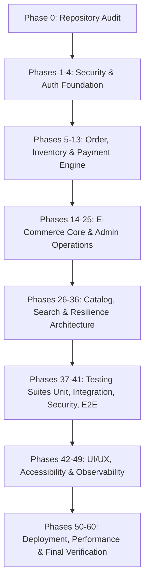

# IMPLEMENTATION PLAN — BOOK STORE PRODUCTION UPGRADE (PHASES 1–60)
**Document Version:** 1.0.0  
**Status:** PHASE 0 COMPLETED — READY FOR PHASE 1–4 EXECUTION  
**Application:** Book Store / Book Review Full-Stack Platform

---

## Architecture Overview & Design Principles

1. **Defense-in-Depth & Fail-Closed Security:** All authorization, price calculations, inventory allocations, and discount enforcements occur authoritatively on the backend.
2. **Zero Insecure Fallbacks:** Production startup aborts immediately with clear error messages if critical secrets (`JWT_SECRET`, `ESEWA_SECRET_KEY`) are missing or insecure.
3. **Data Integrity & Traceability:** Soft-deletion for business entities; immutable inventory transaction logs (`InventoryTransaction`) and administrative audit trails (`AdminAuditLog`).
4. **Idempotency & Concurrency Safety:** MongoDB transactions and unique transaction indexes prevent duplicate orders, double-charging, or race-condition stock deficits.
5. **Clean Monorepo Preservation:** Retain existing `frontend/` and `backend/` structure without introducing Nx or complex toolchains.

---

## Phase Breakdown & Roadmap

---

## PHASE GROUP 1: SECURITY & AUTHENTICATION FOUNDATION (PHASES 1–4)

### Phase 1: Security Secret Hardening
- **Objective:** Eliminate all hardcoded secrets, default JWT tokens, and eSewa fallback keys.
- **Target Files:**
  - `backend/src/utils/config.ts`
  - `backend/src/utils/auth.ts`
  - `docker-compose.yml`
  - `backend/.env.example`
- **Implementation:**
  - Remove all default fallback strings for `JWT_SECRET` and `ESEWA_SECRET_KEY`.
  - Add strict validation in `config.ts`: verify `JWT_SECRET.length >= 32`; throw on startup in production if missing.
  - Clean `docker-compose.yml` to use pure environment variable interpolation without default values.

### Phase 2: Authentication & Session Security
- **Objective:** Prevent stale role exploitation, add session revocation, and implement password reset/email verification.
- **Target Files:**
  - `backend/src/modules/auth/model.ts`
  - `backend/src/modules/auth/service.ts`
  - `backend/src/modules/auth/controller.ts`
  - `backend/src/modules/auth/router.ts`
  - `backend/src/modules/auth/middleware.ts`
  - `backend/src/utils/auth.ts`
- **Implementation:**
  - Add `sessionVersion: { type: Number, default: 1 }`, `isActive: { type: Boolean, default: true }`, `isEmailVerified: { type: Boolean, default: false }`, `passwordResetTokenHash: String`, `passwordResetExpiresAt: Date` to `UserModel`.
  - Update `generateToken` to encode `{ sub: user._id, sessionVersion: user.sessionVersion }`.
  - Update `checkAuth` to fetch active user from database (or high-speed memory cache) and verify `user.isActive === true` and `payload.sessionVersion === user.sessionVersion`.
  - Add `POST /api/auth/forgot-password` (generates random 32-byte crypto token, stores SHA-256 hash).
  - Add `POST /api/auth/reset-password` (verifies hash and expiresAt, updates password, increments `sessionVersion`).
  - Add `POST /api/auth/email-verification/send` and `POST /api/auth/email-verification/verify`.
  - When changing password (`changePasswordService`), increment `sessionVersion` to terminate all other active sessions.

### Phase 3: CSRF & Cookie Security
- **Objective:** Protect state-changing operations against CSRF and enforce secure cookie transport.
- **Target Files:**
  - `backend/src/main.ts`
  - `backend/src/modules/auth/controller.ts`
  - `backend/src/utils/security.ts`
- **Implementation:**
  - Enforce `SameSite=Lax` (or `Strict`), `httpOnly=true`, and `secure=true` in production on session cookies.
  - Implement custom request header requirement (`X-Requested-With` or Anti-CSRF token verification) for mutation verbs (`POST`, `PUT`, `PATCH`, `DELETE`).
  - Strict Origin & Referer header validation in production CORS middleware.

### Phase 4: Centralized Authorization & RBAC
- **Objective:** Provide granular, server-side RBAC middleware and eliminate IDOR risks.
- **Target Files:**
  - `backend/src/modules/auth/middleware.ts`
  - All routers (`order/router.ts`, `review/router.ts`, `book/router.ts`, `admin/router.ts`)
- **Implementation:**
  - Standardize authorization guards: `requireAuth()`, `requireRole("admin")`, `requireRole("user", "admin")`.
  - Validate resource ownership on orders, reviews, addresses, wishlists, and payments before executing mutations.

---

## PHASE GROUP 2: ORDER, INVENTORY & PAYMENT ENGINE (PHASES 5–13)

### Phase 5: Order State Machine
- **States:**
  - Order: `PENDING`, `CONFIRMED`, `PROCESSING`, `SHIPPED`, `DELIVERED`, `CANCELLED`, `RETURN_REQUESTED`, `RETURNED`, `REFUND_PENDING`, `REFUNDED`.
  - Payment: `PENDING`, `PROCESSING`, `PAID`, `FAILED`, `PARTIALLY_REFUNDED`, `REFUNDED`.
- **Target Files:**
  - `backend/src/modules/order/model.ts`
  - `backend/src/modules/order/service.ts`
- **Implementation:**
  - Centralize `OrderStateMachine` validating allowed transitions; block arbitrary jumps.

### Phase 6: Inventory Stock Reservation & Automatic TTL Worker
- **Objective:** Eliminate overselling by reserving stock during checkout with an automatic expiration worker.
- **Target Files:**
  - `backend/src/modules/book/model.ts` (`stock`, `reservedStock`, `availableStock` virtual)
  - `backend/src/modules/order/service.ts`
  - `backend/src/modules/order/worker.ts` (background reservation cleanup)
- **Implementation:**
  - Online checkout places stock in `reservedStock`.
  - Successful payment converts `reservedStock` to sale (`stock -= quantity`, `reservedStock -= quantity`).
  - Expired reservation (15-minute TTL) releases `reservedStock` back to available stock.

### Phase 7: Inventory Transaction Ledger
- **Model:** `InventoryTransaction` (`bookId`, `quantity`, `type`: `SALE` | `RESERVATION` | `RELEASE` | `RESTOCK` | `RETURN` | `ADJUSTMENT`, `referenceId`, `reason`, `performedBy`, `createdAt`).
- **Target Files:**
  - `backend/src/modules/inventory/model.ts`
  - `backend/src/modules/inventory/service.ts`

### Phase 8: Order Data Integrity & Soft Deletion
- **Implementation:**
  - Replace `findByIdAndDelete` with `softDeleted: true`, `archivedAt: Date`, `archivedBy: ObjectId`.
  - Embed frozen book snapshots (`title`, `author`, `unitPrice`, `isbn`, `coverImage`) in order items.

### Phase 9: Book Soft Deletion
- **Implementation:**
  - Add `isActive: Boolean`, `deletedAt: Date`, `deletedBy: ObjectId` to `BookModel`.
  - Catalog queries filter `{ isActive: { $ne: false }, deletedAt: null }`.

### Phase 10: Payment Security & Idempotency
- **Model:** `PaymentModel` (`provider`, `transactionId`, `paymentReference`, `amount`, `currency`, `orderId`, `status`, `verifiedAt`, `rawResponse`).
- **Target Files:**
  - `backend/src/modules/payment/model.ts`
  - `backend/src/modules/payment/service.ts`
- **Implementation:**
  - Server-to-server gateway verification for Khalti and eSewa.
  - Unique compound index on `{ provider: 1, transactionId: 1 }` prevents double crediting.

### Phase 11: Demo Payment Guard
- **Implementation:**
  - Enforce fail-closed check: `if (process.env.NODE_ENV === "production" && paymentMethod === "demo") throw APIError.forbidden("Demo payments disabled in production");`.
  - Hide demo payment UI elements in production frontend builds.

### Phase 12: Real Refund Workflow
- **Model:** `RefundModel` (`orderId`, `paymentId`, `amount`, `reason`, `status`: `REQUESTED` | `APPROVED` | `PROCESSING` | `COMPLETED` | `REJECTED`, `providerRefundId`, `requestedBy`, `approvedBy`, `completedAt`).

### Phase 13: Shipping & Tracking
- **Fields:** `shippingProvider`, `trackingNumber`, `shippedAt`, `estimatedDeliveryAt`, `deliveredAt`, `deliveryStatus`.

---

## PHASE GROUP 3: E-COMMERCE CORE & ADMIN OPERATIONS (PHASES 14–25)

### Phase 14: Server-Side Cart Synchronization
- **Model:** `CartModel` (`userId`, `items: [{ bookId, quantity, addedAt }]`).
- **Implementation:**
  - Guest cart merges with server cart upon user login.
  - Cart totals, stock, and active status revalidated server-side before checkout.

### Phase 15: Persistent Wishlist
- **Model:** `WishlistModel` (`userId`, `books: [ObjectId]`).
- **Implementation:**
  - Authenticated wishlist CRUD with guest localStorage syncing upon login.

### Phase 16: Checkout Hardening
- **Implementation:**
  - Backend authoritatively calculates subtotal, discounts, tax, shipping, and grand total. Never trust client payload numbers.

### Phase 17: Saved Address Management
- **Model:** `AddressModel` (`userId`, `fullName`, `phone`, `street`, `city`, `province`, `postalCode`, `isDefault`).

### Phase 18: Coupon & Promotion Engine
- **Model:** `CouponModel` (`code`, `discountType`, `discountValue`, `minOrderAmount`, `maxDiscount`, `usageLimit`, `usedCount`, `startDate`, `endDate`, `isActive`).

### Phase 19: Review System Hardening
- **Model:** `ReviewReportModel` (`reviewId`, `reportedBy`, `reason`, `status`).
- **Implementation:**
  - Verified Purchase flag requires `paymentStatus === "completed"` or `status === "delivered"`.

### Phase 20: Review Moderation Dashboard
- **Implementation:**
  - Admin review moderation states (`VISIBLE`, `FLAGGED`, `HIDDEN`, `REMOVED`) with audit history.

### Phase 21: Admin Audit Trail
- **Model:** `AdminAuditLogModel` (`adminId`, `action`, `targetType`, `targetId`, `oldValue`, `newValue`, `ipAddress`, `timestamp`).

### Phase 22: Email Notification Engine
- **Implementation:**
  - Pluggable notification service (SMTP / SendGrid / Console fallback) for order, payment, and security events.

### Phase 23: Invoice Generation
- **Implementation:**
  - PDF/HTML invoice rendering with unique sequential invoice numbers.

### Phase 24: Configurable Tax Engine
- **Implementation:**
  - Server-side tax rates (e.g. VAT) with configurable inclusion/exclusion policies.

### Phase 25: Account Profile & Security Settings
- **Implementation:**
  - Change email with verification, view active sessions, logout all devices, and soft account deletion.

---

## PHASE GROUP 4: CATALOG, SEARCH & RESILIENCE (PHASES 26–36)

- **Phase 26 (Catalog Ingestion):** Decouple Google Books discovery results from official merchant store catalog. Require admin import to sell.
- **Phase 27 (External API Resilience):** Circuit breaker, timeouts (7s), retry with exponential backoff for Google Books and Open Library.
- **Phase 28 (Search Hardening):** Safe regex escaping, pagination guards (max limit 50, max page 500).
- **Phase 29 (API Client Standardization):** Centralize frontend HTTP communication in `frontend/src/lib/api/` with Axios interceptors.
- **Phase 30 (Session Error Handling):** Automatic 401 handling with login redirection preserving `?redirect=...`.
- **Phase 31 (Route Protection):** Frontend `ProtectedRoute` and `AdminRoute` wrappers.
- **Phase 32 (Health Checks):** Separate public `/health/live` from private `/health/ready`.
- **Phase 33 (Rate Limiting):** Specific rate limiters on login (5/min), checkout (10/min), and search (60/min).
- **Phase 34 (Input Validation):** Comprehensive Zod schemas across all request parameters.
- **Phase 35 (Indexes & Constraints):** Add compound indexes on `OrderModel`, `UserModel`, `BookModel`, and `PaymentModel`.
- **Phase 36 (MongoDB Transactions):** Enforce atomic multi-document writes for checkout and inventory updates.

---

## PHASE GROUP 5: TESTING & QUALITY ASSURANCE (PHASES 37–41)

- **Phase 37 (Testing Foundation):** Node test runner setup with isolated test database.
- **Phase 38 (Unit Tests):** Order calculations, tax rules, JWT signing, state transitions.
- **Phase 39 (Integration Tests):** Full auth flows, order placements, payments, admin moderation.
- **Phase 40 (Security Tests):** NoSQL injection payloads, XSS, token tampering, IDOR exploitation tests.
- **Phase 41 (E2E Tests):** User purchase flows, cart checkout, payment callback, admin dashboard.

---

## PHASE GROUP 6: UX, OBSERVABILITY & PRODUCTION READINESS (PHASES 42–60)

- **Phases 42–45:** Loading/Error/Empty UX states, React Error Boundaries, WCAG 2.1 AA Accessibility, Responsive mobile polish (320px–1440px).
- **Phases 46–49:** SEO metadata (OpenGraph, JSON-LD Book Schema), Book recommendations, Support tickets, Structured JSON logging with request IDs.
- **Phases 50–54:** Deployment hardening, Strict CORS origins, Helmet CSP headers, Request body limits (1MB), File upload signature checks.
- **Phases 55–56:** Admin analytics widgets and dashboard performance optimization.
- **Phases 57–60:** Documentation, Dead code cleanup, React Query caching optimization, and Final full-suite QA pass.

---

## Verification & Execution Gates

Every phase must satisfy:
1. `npx tsc --noEmit` on backend passes with 0 errors.
2. `npx tsc -b` on frontend passes with 0 errors.
3. Automated unit and integration test scripts pass.
4. No regressions introduced to existing working features.
